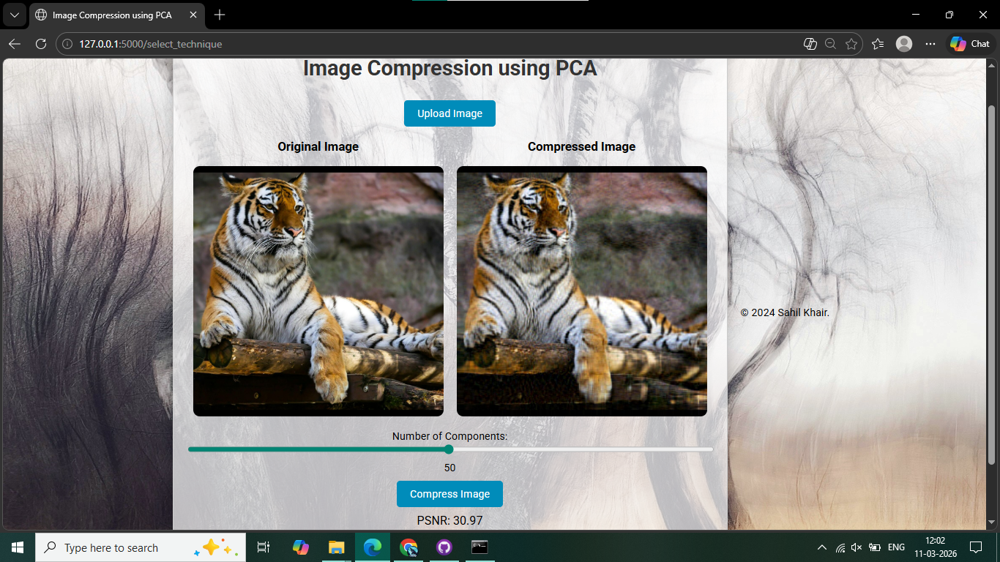

# Image-Compression-Analysis
###A Comparative Analysis of Dimensionality Reduction Techniques

---

##Project Overview
This project is an interactive web-based platform designed to explore and apply three advanced image compression techniques: **Principal Component Analysis (PCA)**, **Singular Value Decomposition (SVD)**, and **Independent Component Analysis (ICA)**.

Built using Python and Flask, the application allows users to upload images, select a compression method, and adjust the number of components via an interactive slider to observe real-time trade-offs between image quality and file size.

---

##Research & Methodology
This application is based on a formal study titled *"Optimizing Image Compression: A Comparative Analysis of Dimensionality Reduction Techniques"*. 

The study evaluated performance across different image resolutions (256x256, 512x512, and 1024x1024) using three key metrics:

* **MSE (Mean Squared Error)**: Quantifies the difference between pixels.
* **PSNR (Peak Signal-to-Noise Ratio)**: Measures reconstruction quality.
* **Compression Ratio**: Evaluates storage efficiency.

---

##Key Research Findings
| Technique | Best For | Conclusion |
| :--- | :--- | :--- |
| **PCA** | **High Fidelity** | Consistently offers the best image reconstruction quality with the highest PSNR. |
| **SVD** | **Efficiency** | Provides superior compression ratios, ideal for prioritizing storage and bandwidth. |
| **ICA** | **Feature Analysis** | Advantageous for applications requiring the extraction of independent components. |

---

##Features
* **Interactive UI:** Real-time adjustment of components using a slider.
* **Side-by-Side Comparison:** View the original and compressed images simultaneously.
* **Live Metrics:** Real-time calculation of PSNR values to quantify quality loss.
* **Multi-Algorithm Support:** Toggle between PCA, SVD, and ICA instantly.

---

##Tech Stack
* **Backend:** Python (Flask)
* **Mathematical Libraries:** NumPy, Scikit-learn, OpenCV
* **Frontend:** HTML5, CSS3, JavaScript
* **Documentation:** Full research paper included in /docs

---

##Project StructurePlain
'''text
├── app.py              # Main Flask application & Logic
├── static/             # CSS and Image assets
├── templates/          # HTML Frontend
├── docs/               # Research paper and documentation (PDF)
├── requirements.txt    # List of dependencies
└── README.md           # Project overview

---

##Installation & Usage
* **Clone the repository:** git clone https://github.com/khairsahil/Image-Compression-Analysis.git
* **Install dependencies:** pip install -r requirements.txt
* **Run the app:** python app.py
* Open your browser and navigate to http://127.0.0.1:5000.

---

Developed as part of the M.Sc. Data Science curriculum at Kirti M. Doongursee College.

---

## 👤 Author
**Sahil Khair** [LinkedIn](https://www.linkedin.com/in/sahil-khair-1268a6272) | [Email](mailto:khairsahil0@gmail.com)

